# Cane Corso Growth Intelligence

Cane Corso Growth Intelligence is a machine learning course project focused on dog growth analysis.

The project uses the Cane Corso domain as a practical context, but the machine learning work follows the course topics step by step. Each stage is implemented in a separate notebook, documented, committed to GitHub, and kept reproducible.

This project does not provide veterinary diagnosis. All models and labels are used only for educational machine learning experiments.

## Current Project Status

The project currently includes three completed stages:

1. **Linear Regression, Regularization and Testing**
2. **Real Data Foundation**
3. **Classification**

The next planned course topic is:

```text
Unsupervised Learning, Clustering
```

## Project Structure

```text
cane-corso-growth-intelligence/
├── data/
│   ├── prototype/
│   │   └── cane_corso_growth_sample.csv
│   ├── raw/
│   │   └── source_notes.md
│   └── processed/
│       ├── dog_growth_public_sample.csv
│       └── dog_growth_classification_sample.csv
├── docs/
│   ├── real_data_source_notes.md
│   ├── real_data_download_instructions.md
│   ├── data_preparation_plan.md
│   ├── math_foundation.md
│   └── geometric_interpretation.md
├── notebooks/
│   ├── 01_linear_regression_growth_prediction.ipynb
│   ├── 02_real_data_preparation.ipynb
│   └── 03_classification_growth_status.ipynb
├── reports/
│   └── figures/
│       ├── regression_coordinate_system.png
│       ├── polynomial_curve_coordinate_system.png
│       ├── classification_feature_space_boundary.png
│       └── clustering_feature_space_concept.png
├── src/
│   ├── create_public_sample.py
│   └── create_classification_sample.py
├── COURSE_TOPIC_MAPPING.md
├── DATA_SOURCES.md
├── HOW_TO_RUN.md
├── PROJECT_BRIEF.md
├── README.md
└── requirements.txt
```

## Course Topic Flow

```mermaid
flowchart TD
    A["Machine Learning Course Project"] --> B["Topic 1: Linear Regression, Regularization and Testing"]
    A --> C["Real Data Foundation"]
    A --> D["Topic 2: Classification"]
    A --> E["Next Topic: Unsupervised Learning, Clustering"]

    B --> B1["Simple Linear Regression"]
    B --> B2["Polynomial Regression"]
    B --> B3["Multi-Dimensional Regression"]
    B --> B4["Ridge and Lasso"]
    B --> B5["RANSAC"]
    B --> B6["Regression Model Comparison"]

    C --> C1["Public Dog Growth Dataset Source"]
    C --> C2["Raw Data Kept Local"]
    C --> C3["Processed Public Sample"]
    C --> C4["Balanced Classification Sample"]

    D --> D1["Logistic Regression"]
    D --> D2["Confusion Matrix and Metrics"]
    D --> D3["ROC and AUC"]
    D --> D4["Decision Tree"]
    D --> D5["Random Forest and AdaBoost"]
    D --> D6["Support Vector Machine"]
    D --> D7["Classification Model Comparison"]
```



## Notebooks

### 1. Regression Topic

```text
notebooks/01_linear_regression_growth_prediction.ipynb
```

This notebook covers:

- regression problem statement and motivation
- initial data exploration
- simple linear regression
- polynomial regression
- multi-dimensional linear regression
- Ridge and Lasso regularization
- RANSAC robust regression
- regression model testing and comparison

### 2. Real Data Preparation

```text
notebooks/02_real_data_preparation.ipynb
```

This notebook prepares the project for working with a real public dog growth dataset.

The full raw dataset is not committed to GitHub. It is kept locally in `data/raw/` only.

### 3. Classification Topic

```text
notebooks/03_classification_growth_status.ipynb
```

This notebook covers:

- classification problem statement and motivation
- binary classification target: `growth_status`
- Logistic Regression
- confusion matrix
- accuracy, precision, recall, and F1-score
- ROC curve and AUC
- Decision Tree Classifier
- Random Forest
- AdaBoost
- Support Vector Machine
- final classification model comparison

## Data Layers

### Prototype Dataset

```text
data/prototype/cane_corso_growth_sample.csv
```

This small educational dataset is used for the first regression experiments.

### General Processed Real Public Sample

```text
data/processed/dog_growth_public_sample.csv
```

This file contains:

- 10,000 rows
- 12 columns
- age and bodyweight information
- body condition information
- source label: `real_public_processed_sample`

It was created with:

```text
src/create_public_sample.py
```

### Classification-Focused Processed Sample

```text
data/processed/dog_growth_classification_sample.csv
```

This balanced sample is used for the Classification topic.

It contains:

- 10,000 rows
- 15 columns
- 5,000 `normal_growth` records
- 5,000 `needs_attention` records
- binary target column: `growth_status_binary`
- source label: `real_public_classification_sample`

It was created with:

```text
src/create_classification_sample.py
```


## Mathematical Foundation

The project includes a mathematical foundation document:

```text
docs/math_foundation.md
```

This document explains the main formulas behind the completed stages:

- Linear Regression and Ordinary Least Squares
- Polynomial and Multi-Dimensional Regression
- MAE, MSE, RMSE, and R2 Score
- Ridge and Lasso Regularization
- RANSAC Robust Regression
- Logistic Regression and the Sigmoid Function
- Confusion Matrix, Accuracy, Precision, Recall, and F1-score
- ROC Curve and AUC
- Decision Trees, Gini, Entropy, and Information Gain
- Random Forest, AdaBoost, and Support Vector Machine
- planned clustering mathematics for the next topic

The goal is to show that the project is not only using machine learning libraries, but also explains the mathematical ideas behind the models.


## Geometric Interpretation

The project also includes a visual geometric explanation of the models:

```text
docs/geometric_interpretation.md
```

This document explains how data records become points in a coordinate system, how regression learns lines or curves, how classification learns decision boundaries, and how clustering groups nearby points.

The generated figures are stored in:

```text
reports/figures/
```

## Raw Data Rule

The original public dataset ZIP is large and is not committed to GitHub.

Only the processed samples are committed. The raw files are kept locally in:

```text
data/raw/
```

The repository keeps only:

```text
data/raw/source_notes.md
```

## Current Learning Progress

Completed course stages:

```text
Linear Regression, Regularization and Testing ✅
Real Data Foundation ✅
Classification ✅
```

Next planned stage:

```text
Unsupervised Learning, Clustering ⏳
```

Future topics will be added topic by topic, notebook by notebook, and commit by commit.
