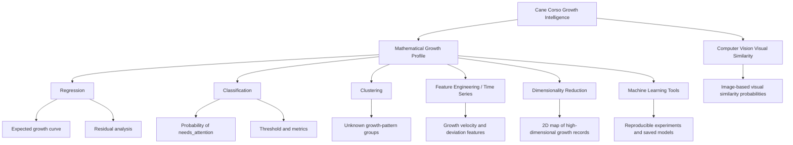

# Cane Corso Growth Intelligence

**Machine Learning for Predictive Growth Monitoring and Early Growth Pattern Detection**

Cane Corso Growth Intelligence is a machine learning project that turns dog growth records into mathematical, visual, and owner-friendly insights.

The project is not only about predicting a dog's weight. The stronger idea is to build a **mathematical growth profile**: a way to represent each growth record as data, compare it with expected development, detect unusual patterns, group similar development profiles, and explain the result clearly.

The practical story is simple: an owner can record information such as age, weight, sex and body measurements over time. The system can then estimate expected growth, classify whether the record looks normal or needs attention, compare the dog with similar growth patterns, and show the result through understandable signals and charts.

This is an educational machine learning project. It does **not** provide veterinary diagnosis, medical advice, pedigree proof, or breed certification. Model outputs are used for analysis, learning, comparison, and responsible monitoring only.

---

## Academic focus, course coverage, and practical direction

This project is designed as a Machine Learning final exam project with both an academic and a practical direction.

The project was developed progressively during the course. After each relevant lecture and exercise, the newly covered material was applied to the same project instead of being kept as separate isolated examples. This approach shows how one real-world machine learning idea can evolve step by step: from regression and testing, through classification, clustering, feature engineering and dimensionality reduction, to machine learning tooling, reproducibility and saved model artifacts.

The academic goal is to demonstrate understanding of the main machine learning topics covered in the course: linear regression, regularization and testing, classification, unsupervised learning and clustering, feature engineering and time series, dimensionality reduction, and machine learning tools. The project does not focus only on producing predictions. It also explains the mathematical and methodological reasoning behind the selected approaches, including assumptions, limitations, metrics, validation, and interpretation.

The practical goal is to explore how machine learning can support structured Cane Corso growth and development analysis in a real-world context. The idea is translated into several machine learning tasks: predicting growth-related values, classifying growth status, grouping similar development profiles, engineering time-aware features, reducing dimensionality for interpretation, and organizing experiments in a reproducible way.

Some parts of the repository go beyond the minimum notebook requirement because the project is also being prepared as a possible foundation for future integration into a real Cane Corso platform. These additional parts include reusable Python scripts, configuration files, validation scripts, reports, saved model artifacts, a model card, and a one-line Machine Learning Tools workflow.

The exploratory Computer Vision / visual-similarity materials are included only as a long-term research and preparation direction. They are not presented as the main exam deliverable, a completed production feature, breed proof, or certification logic. They show possible future steps for connecting responsible growth intelligence, visual comparison, and owner-friendly explanations inside the planned USG Cane Corso platform ecosystem (`www.usg-cane-corso-platform.com`).
My first interest was JavaScript and web development, because I wanted to build the USG Cane Corso platform from the ground up. For almost two years, I have been learning and applying what I learn step by step while continuing to develop the platform, even though it is still not finished. This machine learning project extends that same long-term direction: it explores how future platform intelligence and data-driven analysis could support Cane Corso growth monitoring in a responsible way.


These extensions do not replace the academic notebook work. They support reproducibility, testing, maintainability, clearer evaluation, and possible future real-world use.

Recommended review path:

1. `notebooks/final_project_cane_corso_growth_intelligence.ipynb`
2. `COURSE_TOPIC_MAPPING.md`
3. `README.md`
4. `HOW_TO_RUN.md`
5. `notebooks/07_machine_learning_tools_exercise_alignment.ipynb`
6. `reports/machine_learning_tools/step21_machine_learning_tools_report.md`
7. `reports/machine_learning_tools/model_card_growth_status.md`

----

## Why This Project Is Interesting

Large-breed puppies can grow quickly and unevenly. A single measurement, such as today's weight, is not enough to understand the full development story.

The project is also useful because, in large and giant breeds, growth speed and bodyweight are not only numbers. Very rapid growth or excessive weight gain can place extra stress on the developing bones and joints while the dog is still growing. For this reason, the project treats growth monitoring as a practical data problem: not to diagnose disease, but to observe development trends, deviations and signals that may deserve closer attention.

This project treats growth as a mathematical process:

```text
simple owner record -> feature vector -> model prediction -> error / probability / cluster -> interpretation
```

Instead of asking only:

```text
How many kilograms will the dog weigh?
```

it asks stronger machine-learning questions:

```text
Is this growth record close to the expected pattern?
How large is the deviation from the model prediction?
What is the probability that the record needs attention?
Which growth-pattern group does this dog resemble?
How does the trajectory change over time?
How do different models compare mathematically?
```

This makes the project useful beyond a course assignment: it can become the foundation for a practical growth-monitoring system.

A dedicated motivation note is available in:

```text
docs/growth_monitoring_motivation.md
```

---

## Mathematical Framing

Each dog growth record is represented as a feature vector:

```text
x = [age_months, weight_kg, height_cm, sex_encoded, body_ratio, growth_velocity, deviation_from_expected]
```

Different course topics use the same data representation in different ways:

| Course area | Mathematical task | Project meaning |
|---|---|---|
| Regression | learn `weight = f(x)` | estimate expected growth / future bodyweight |
| Classification | learn `P(needs_attention | x)` | create a probability-based growth signal |
| Clustering | discover unknown groups | find natural growth-pattern profiles and compare distance/density methods |
| Feature Engineering | transform raw measurements | create growth velocity, ratios, deviations |
| Time Series | analyze ordered records | monitor development as a trajectory |
| Dimensionality Reduction | project high-dimensional data | visualize structure and separation |
| Machine Learning Tools | compare reproducible experiments, metrics and saved model artifacts | organize configurable runs, compare models, save the best pipeline, document limitations and keep MLflow-compatible tracking |

The project is designed to show the full flow:

```text
real-world problem -> mathematical formulation -> data preparation -> model training -> evaluation -> interpretation -> limitations
```


## Current Course Alignment

The core project follows the machine-learning topics covered so far in the course. At the current stage, the project is aligned with the course sequence through **Dimensionality Reduction and Manifold Learning**:

```text
Linear Regression / Regularization / Testing
Classification
Unsupervised Learning and Clustering
Feature Engineering and Time Series
Dimensionality Reduction and Manifold Learning
```

The latest course-aligned addition is **Step 20.1 — Problem 5 Component Analysis**. It strengthens the Dimensionality Reduction exercise by adding SVD component interpretation, example high-value records, visualization coordinates and written analysis.

The latest completed course topic is:

```text
Machine Learning Tools
```

Step 21 adds a configurable workflow, experiment comparison, model persistence, a model card, validation, reporting and smoke testing.

The image-based work is documented as an **exploratory visual-similarity extension**, not as a required course topic and not as a breed-certification system. Its purpose is to test whether a small public image dataset can support an educational comparison between available large-dog classes. The core grading evidence remains the tabular growth-intelligence workflow: regression, classification, clustering, feature engineering, time-series features, evaluation, documentation, and responsible interpretation.

A course progression note is available in:

```text
docs/course_progression_plan.md
```

---

## Final Submission Notebook

The project now includes a lightweight evaluator-friendly final notebook:

```text
notebooks/final_project_cane_corso_growth_intelligence.ipynb
```

This notebook acts as the main course submission backbone. It summarizes the project idea, mathematical framing, data strategy, regression, classification, clustering, feature engineering, time-series perspective, optional computer vision extension, results, limitations and future work.

It is intentionally safe for GitHub and course review: it does not download external datasets, does not require image archives, does not train heavy models, and does not load model weights. It reads only the small report files that already exist in the repository.

A submission readiness audit is available in:

```text
docs/final_submission_readiness_audit.md
```

---

## Notebook Mathematical Formulation Standard

Every notebook now follows the same mathematical section before the main implementation:

```text
Input vector X
Target y
Model function f(x)
Loss function
Metrics
Interpretation
Limitations
```

This keeps each lecture connected to the same mathematical growth-profile story and makes the project easier to defend. A reusable template is available in:

```text
docs/notebook_mathematical_formulation_template.md
```

---

## How the Model Learns

The models learn from historical growth records.

For regression, the model predicts a numerical value and compares the prediction with the known real value:

```text
residual = real_weight - predicted_weight
```

Training means finding parameters that reduce prediction error, for example by minimizing squared error:

```text
minimize sum((y_real - y_pred)^2)
```

For classification, the model learns a probability:

```text
P(needs_attention | x)
```

A threshold converts that probability into a class:

```text
if probability >= threshold -> needs_attention
else -> normal_growth
```

The project evaluates models on unseen test data using metrics such as MAE, RMSE, R2, precision, recall, F1-score, ROC and AUC.

A dedicated explanation is available in:

```text
docs/model_learning_explanation.md
```

---


## Current Lecture Coverage: Feature Engineering and Time Series

The fourth lecture stage is now represented by:

```text
notebooks/05_feature_engineering_time_series_growth.ipynb
```

The notebook includes:

- feature engineering problem formulation;
- ordered growth records as a simple time series;
- lag features from previous measurements;
- weight gain and height gain;
- growth velocity per month;
- weight-to-height ratio;
- rolling average smoothing;
- z-score growth velocity signal;
- engineered feature correlation check;
- responsible Cane Corso growth-monitoring interpretation.

The tone is intentionally learning-oriented: formulas are shown before code, and each feature is connected to the project meaning.

## Data Foundation

The project uses two data layers.

### 1. Prototype Cane Corso Sample

```text
data/prototype/cane_corso_growth_sample.csv
```

A small educational sample created for the first regression experiments.

### 2. Real Public Dog Growth Dataset

The stronger project foundation is a public dog growth dataset from the University of Liverpool DataCat:

```text
Growth standard charts for monitoring bodyweight in dogs of different sizes - SUPPORTING DATA
```

The related scientific publication is:

```text
Growth standard charts for monitoring bodyweight in dogs of different sizes, PLOS ONE, 2017
```

The project does **not** claim to have private Cane Corso veterinary records. The Cane Corso domain is the practical product case, while the real public dataset provides the broader growth-data foundation for machine learning experiments.

The initial Cane Corso prototype sample is intentionally small and is used for early mathematical framing and first regression experiments. The broader machine learning experiments use processed public dog-growth samples with larger record counts, while future real-world platform use would require more Cane Corso-specific longitudinal data collected responsibly over time.

Processed samples used in the project:

```text
data/processed/dog_growth_public_sample.csv
data/processed/dog_growth_classification_sample.csv
data/processed/cane_corso_time_series_features.csv
```

### Why This Dataset Instead of Kaggle?

Kaggle is a useful place to search for public datasets, but the project needs more than general dog metadata. The mathematical task requires growth-related information such as age, bodyweight and repeated monitoring logic.

For that reason, the project uses the University of Liverpool DataCat / PLOS ONE dog growth dataset as the selected real public foundation. It is more directly connected to dog bodyweight growth standards than a random dog-related Kaggle dataset.

A dedicated explanation is available in:

```text
docs/dataset_selection_rationale.md
```


### Exploratory Visual Similarity Extension


The core exam deliverable remains the tabular Machine Learning workflow and the final project notebook. In addition, the repository includes an optional exploratory Computer Vision / visual-similarity direction for future work and possible later integration into the planned USG Cane Corso platform ecosystem (`www.usg-cane-corso-platform.com`).

This extension is preparation for future development only. It is not the main exam deliverable, not a completed production module, and not breed-proof, pedigree-proof, certification, registry, or veterinary logic.

The exploratory visual-similarity idea is:

```text
uploaded dog image -> visual feature extractor -> visual similarity probabilities
```

This is documented as a future **visual similarity classifier**, not as a breed-proof system. The project does not currently have a private Cane Corso image dataset. The first stage is therefore data research, public dataset feasibility, and a manifest-based data plan.

Supporting files:

```text
docs/computer_vision_visual_similarity_plan.md
docs/image_dataset_research_plan.md
docs/image_dataset_feasibility.md
docs/image_dataset_acquisition_and_local_preparation.md
notebooks/08_computer_vision_visual_similarity_concept.ipynb
notebooks/09_image_dataset_feasibility.ipynb
notebooks/10_image_dataset_acquisition_local_preparation.ipynb
data/image_dataset_manifest_example.csv
data/image_dataset_feasibility_matrix.csv
data/molossoid_visual_target_classes.csv
data/image_dataset_local_inventory_template.csv
src/validate_image_manifest.py
src/validate_image_dataset_feasibility.py
src/prepare_image_dataset_structure.py
src/validate_local_image_dataset.py
```

### Raw Dataset Archive Terminology

The original public dataset is distributed by its source as a compressed archive file. In this project, that file is called the **raw dataset archive**:

```text
data/raw/Final_Data_PLOS.zip
```

This term refers only to the original public dataset distribution format. The raw archive is kept local and ignored by the repository. The notebooks use the smaller processed CSV files stored in `data/processed/`.

A detailed explanation is available in:

```text
docs/raw_dataset_archive_policy.md
```

---

## Current Project Status

Completed stages:

1. **Linear Regression, Regularization and Testing**
2. **Real Data Foundation**
3. **Classification**
4. **Classification Pipeline Exercise Extension**
5. **Course Coverage Alignment** — added clearer OLS, real-data regression, Precision-Recall, thresholds, tuning and drift coverage
6. **Unsupervised Learning and Clustering** — added K-Means, k-means++, Hierarchical Clustering, method comparison and DBSCAN
7. **Clustering Mathematical Application Polish** — strengthened the practical application bridge, formulas and responsible interpretation for the clustering notebook
8. **Feature Engineering and Time Series** — added lag features, growth velocity, rolling averages, z-score signals and trajectory visualizations
9. **Dataset Selection Rationale** — documented why the Liverpool DataCat / PLOS ONE dog growth dataset was selected instead of a generic Kaggle dataset
10. **Computer Vision Visual Similarity Plan** — added a future image-classification extension plan, dataset research strategy, manifest example and responsible visual-similarity boundary
11. **Public Image Dataset Feasibility** — added public image dataset candidates, target molossoid class planning, repository data rules and validation before image-model training
12. **Image Dataset Acquisition and Local Preparation** — added local-only image dataset structure, inventory template and validation scripts before any image model training
13. **Dimensionality Reduction and Manifold Learning** — added PCA, Kernel PCA, LinDA, Isomap, t-SNE visualization planning and representation comparison
14. **Problem 5 Component Analysis** — strengthened SVD component interpretation with example records, visualization coordinates and written conclusions
15. **Machine Learning Tools** — added configurable experiment comparison, model persistence, model card, validation, reporting and MLflow-compatible tracking

The visual-similarity work is documented as an optional future extension outside the current core course sequence. It supports longer-term preparation for the planned USG Cane Corso platform ecosystem, but it must not be presented as breed proof, certification logic, veterinary logic, or the main course deliverable.


---

## Recommended Review Order

For a concise ordered notebook map, see `docs/notebook_reading_sequence.md`.


For a reviewer or instructor, the easiest order is:

```text
1. README.md
2. PROJECT_BRIEF.md
3. DATA_SOURCES.md
4. docs/dataset_selection_rationale.md
5. docs/computer_vision_visual_similarity_plan.md
6. docs/image_dataset_research_plan.md
7. docs/image_dataset_feasibility.md
8. docs/image_dataset_acquisition_and_local_preparation.md
9. COURSE_TOPIC_MAPPING.md
8. notebooks/00_project_concept_and_mathematical_framing.ipynb
9. notebooks/01_linear_regression_growth_prediction.ipynb
10. notebooks/02_real_data_preparation.ipynb
11. notebooks/03_classification_growth_status.ipynb
12. notebooks/03_1_classification_pipeline_exercise.ipynb
13. notebooks/04_unsupervised_learning_clustering.ipynb
14. notebooks/05_feature_engineering_time_series_growth.ipynb
15. notebooks/05_1_practical_growth_assessment_workflow.ipynb
16. notebooks/08_computer_vision_visual_similarity_concept.ipynb
17. notebooks/09_image_dataset_feasibility.ipynb
18. notebooks/10_image_dataset_acquisition_local_preparation.ipynb
```

The course mapping file explains exactly where each lecture requirement is covered.

---

## Project Structure

```text
cane-corso-growth-intelligence/
├── data/
│   ├── input/
│   │   └── example_new_cane_corso_measurements.csv
│   ├── images/
│   │   ├── README.md
│   │   └── local_dataset/
│   │       ├── .gitignore
│   │       └── README.md
│   ├── image_dataset_manifest_example.csv
│   ├── image_dataset_feasibility_matrix.csv
│   ├── molossoid_visual_target_classes.csv
│   ├── image_dataset_local_inventory_template.csv
│   ├── prototype/
│   │   └── cane_corso_growth_sample.csv
│   ├── raw/
│   │   └── source_notes.md
│   └── processed/
│       ├── dog_growth_public_sample.csv
│       ├── dog_growth_classification_sample.csv
│       ├── cane_corso_time_series_features.csv
│       └── example_growth_assessment_features.csv
├── docs/
│   ├── dataset_selection_rationale.md
│   ├── computer_vision_visual_similarity_plan.md
│   ├── image_dataset_research_plan.md
│   ├── image_dataset_feasibility.md
│   ├── image_dataset_acquisition_and_local_preparation.md
│   ├── product_idea_and_mathematical_framing.md
│   ├── model_learning_explanation.md
│   ├── real_data_source_notes.md
│   ├── real_data_download_instructions.md
│   ├── raw_dataset_archive_policy.md
│   ├── data_preparation_plan.md
│   ├── math_foundation.md
│   ├── geometric_interpretation.md
│   ├── clustering_learning_notes.md
│   ├── feature_engineering_time_series_notes.md
│   └── practical_growth_assessment_workflow.md
├── notebooks/
│   ├── 00_project_concept_and_mathematical_framing.ipynb
│   ├── 01_linear_regression_growth_prediction.ipynb
│   ├── 02_real_data_preparation.ipynb
│   ├── 03_classification_growth_status.ipynb
│   ├── 03_1_classification_pipeline_exercise.ipynb
│   ├── 04_unsupervised_learning_clustering.ipynb
│   ├── 05_feature_engineering_time_series_growth.ipynb
│   ├── 06_practical_growth_assessment_workflow.ipynb
│   ├── 08_computer_vision_visual_similarity_concept.ipynb
│   ├── 09_image_dataset_feasibility.ipynb
│   └── 10_image_dataset_acquisition_local_preparation.ipynb
├── reports/
│   ├── example_growth_assessment_report.md
│   └── figures/
├── src/
│   ├── create_public_sample.py
│   ├── create_classification_sample.py
│   ├── create_time_series_features.py
│   ├── run_growth_assessment.py
│   ├── validate_image_manifest.py
│   ├── validate_image_dataset_feasibility.py
│   ├── prepare_image_dataset_structure.py
│   └── validate_local_image_dataset.py
├── COURSE_TOPIC_MAPPING.md
├── DATA_SOURCES.md
├── HOW_TO_RUN.md
├── PROJECT_BRIEF.md
├── README.md
└── requirements.txt
```

---

## Notebooks

### 0. Project Concept and Mathematical Framing

```text
notebooks/00_project_concept_and_mathematical_framing.ipynb
```

Explains the product idea, mathematical representation, learning process, data layers, and responsible interpretation boundaries.

### 1. Regression Topic

```text
notebooks/01_linear_regression_growth_prediction.ipynb
```

Covers simple linear regression, polynomial regression, multi-dimensional regression, Ridge, Lasso, RANSAC, and regression metrics.

### 2. Real Data Preparation

```text
notebooks/02_real_data_preparation.ipynb
```

Documents the transition from prototype data to real processed public dog growth data.

### 3. Classification Topic

```text
notebooks/03_classification_growth_status.ipynb
```

Covers binary classification, Logistic Regression, Decision Tree, Random Forest, AdaBoost, SVM, confusion matrix, precision, recall, F1-score, ROC and AUC.

### 3.1. Classification Pipeline Exercise

```text
notebooks/03_1_classification_pipeline_exercise.ipynb
```

Adds dummy baselines, preprocessing pipelines, cross-validation, learning curves, feature engineering, permutation importance, error analysis, and ablation study.

### 4. Unsupervised Learning and Clustering

```text
notebooks/04_unsupervised_learning_clustering.ipynb
```

Covers unsupervised learning motivation, K-Means with `k-means++`, elbow and silhouette checks, Hierarchical Clustering, comparison between K-Means and Hierarchical Clustering, and DBSCAN density-based clustering/noise detection. this stage strengthens the notebook with a clearer real-world application bridge, feature-vector formulation, K-Means objective, DBSCAN review-candidate interpretation and safe product wording.

### 5. Feature Engineering and Time Series

```text
notebooks/05_feature_engineering_time_series_growth.ipynb
```

Covers lag features, growth velocity, weight-to-height ratio, rolling averages, z-score monitoring signals and trajectory visualizations.

### 5.1. Practical Growth Assessment Workflow

```text
notebooks/05_1_practical_growth_assessment_workflow.ipynb
```

### 6. Dimensionality Reduction and Manifold Learning

```text
notebooks/06_dimensionality_reduction_future_course_topic.ipynb
notebooks/06_1_dimensionality_reduction_exercise_project_alignment.ipynb
```

Covers PCA, Kernel PCA, Linear Discriminant Analysis, Isomap, t-SNE visualization planning, TF-IDF + TruncatedSVD alignment and explicit Problem 5 component analysis. The exercise adaptation interprets reduced components through top terms, example records and visualization coordinates.

Shows how new owner-style measurements can be transformed into a readable educational growth assessment report.

### 6. Exploratory Visual Similarity Concept

```text
notebooks/08_computer_vision_visual_similarity_concept.ipynb
```

Introduces the future image-classification extension. It explains visual feature extraction, softmax probabilities, public dataset feasibility and why the output must be interpreted as visual similarity rather than breed proof.

### 8. Image Dataset Feasibility

```text
notebooks/09_image_dataset_feasibility.ipynb
```

Adds a public image dataset feasibility check before any visual-similarity model is trained. It reviews public dataset candidates, target molossoid classes, repository storage rules and responsible limitations.

### 9. Image Dataset Acquisition and Local Preparation

```text
notebooks/10_image_dataset_acquisition_local_preparation.ipynb
```

Documents the local-only image dataset preparation workflow. It explains how future public or consent-based image datasets should be stored locally, ignored by Git, inventoried, split and validated before visual-similarity training.

---

## Course Topic Flow



---

## Documents

| File | Purpose |
|---|---|
| `PROJECT_BRIEF.md` | Main project story and scope |
| `docs/product_idea_and_mathematical_framing.md` | Strong explanation of the useful and interesting idea |
| `docs/model_learning_explanation.md` | How the models learn, gradually |
| `docs/notebook_mathematical_formulation_template.md` | Standard mathematical structure for every new notebook |
| `docs/math_foundation.md` | Mathematical formulas and model intuition |
| `docs/geometric_interpretation.md` | Coordinate-space view of models and feature space |
| `docs/clustering_learning_notes.md` | Unsupervised learning, K-Means, HC and DBSCAN explanation |
| `docs/feature_engineering_time_series_notes.md` | Feature engineering and time-series growth-monitoring notes |
| `docs/practical_growth_assessment_workflow.md` | Applied owner-style growth assessment workflow |
| `docs/dataset_selection_rationale.md` | Explanation of why the Liverpool DataCat / PLOS ONE dataset was selected instead of a general Kaggle dataset |
| `docs/computer_vision_visual_similarity_plan.md` | optional visual-similarity extension plan for visual similarity, not breed proof |
| `docs/image_dataset_research_plan.md` | Public image dataset research and image data governance plan |
| `docs/image_dataset_feasibility.md` | this stage public image dataset feasibility decision before visual-similarity training |
| `docs/image_dataset_acquisition_and_local_preparation.md` | this stage local image dataset acquisition and preparation workflow |
| `DATA_SOURCES.md` | Prototype, raw and processed data documentation |
| `COURSE_TOPIC_MAPPING.md` | Mapping between course lectures and project files |

---

## Responsible Interpretation

The project can support analysis and owner-friendly monitoring, but it must be interpreted carefully.

Correct interpretation:

```text
The model gives an educational growth-monitoring signal based on available data.
```

Incorrect interpretation:

```text
The model diagnoses health problems or proves whether a dog is a Cane Corso.
```

For this stage image dataset feasibility, correct project behavior is:

```text
check public dataset metadata -> verify class availability -> check usage terms -> prepare ignored local folder -> train only after responsible data selection
```

The safest final product direction is:

```text
record data -> show trend -> estimate expected growth -> show signal -> explain limitations
```

For the optional visual-similarity extension, correct interpretation is:

```text
The image has the strongest visual similarity to this trained class.
```

Incorrect interpretation is:

```text
The image proves the dog's official breed, pedigree or registry status.
```

---

## Practical Application Workflow: this stage

The project now includes a small practical workflow that shows how the mathematical features can be used with new owner-style measurements.

Input file:

```text
data/input/example_new_cane_corso_measurements.csv
```

Run script:

```powershell
& ".\.venv\Scripts\python.exe" ".\src\run_growth_assessment.py"
```

Generated outputs:

```text
data/processed/example_growth_assessment_features.csv
reports/example_growth_assessment_report.md
reports/figures/practical_growth_assessment_weight_trend.png
reports/figures/practical_growth_assessment_velocity_signal.png
```

The practical workflow uses the same mathematical ideas introduced in the Feature Engineering and Time Series notebook: difference features, growth velocity, rolling means, z-score comparison and normalized distance.

This makes the project more applicable: it is no longer only a set of training notebooks, but also a small educational growth-monitoring pipeline.

Responsible use boundary: the report is not a veterinary diagnosis, treatment plan, breed certificate, pedigree proof or official health judgement. It is a learning-based analytical report.


---

## Computer Vision Local Image Dataset Preparation: this stage

this stage adds a local-only preparation workflow for future image datasets.

Prepare local folders:

```powershell
python src/prepare_image_dataset_structure.py
```

Validate local structure:

```powershell
python src/validate_local_image_dataset.py
```

The folder `data/images/local_dataset/` is ignored by Git. It can contain downloaded public image datasets or future permission-based owner photos on the developer machine, but image files should not be committed.

Responsible boundary: this stage prepares data governance and local structure only. It does not download images, train a visual-similarity model, or prove breed identity.


## First Public Image Dataset Candidate

The project now documents the first public dataset candidate for the future Computer Vision visual-similarity module:

```text
Stanford Dogs / ImageNet Dogs
```

This stage does not download images and does not train an image model. It explains how the dataset should be prepared locally, why images should not be committed to the repository, and how local labels/classes should be inspected before any baseline classifier is trained.

Related files:

```text
docs/first_public_image_dataset_candidate_download_guide.md
data/first_public_image_dataset_candidate.csv
data/stanford_dogs_local_download_checklist.csv
notebooks/12_first_public_image_dataset_candidate_download_guide.ipynb
src/validate_first_public_image_dataset_candidate.py
src/inspect_stanford_dogs_local_dataset.py
```

Responsible boundary:

```text
visual similarity only; not breed proof, pedigree proof, registry proof or veterinary diagnosis
```


## Local Stanford Dogs Inspection / Baseline Class Selection

The project now includes an evidence-based baseline class-selection workflow for the future Computer Vision visual-similarity module.

this stage does not train an image model. It checks which selected baseline classes are actually available in the local Stanford Dogs dataset folders and writes a small report.

Related files:

```text
docs/local_stanford_dogs_inspection_baseline_class_selection.md
docs/baseline_visual_class_selection_policy.md
data/stanford_dogs_baseline_class_candidates.csv
data/stanford_dogs_baseline_class_selection_template.csv
notebooks/13_local_stanford_dogs_inspection_baseline_class_selection.ipynb
src/select_stanford_dogs_baseline_classes.py
src/validate_stanford_baseline_class_selection.py
```

Important boundary:

```text
If Cane Corso, Dogo Argentino or Presa Canario are not confirmed in the selected public dataset, the project must not claim that the model can recognize them.
```


## Stanford Dogs Local Download / Real Class Inspection

this stage adds a safe local Stanford Dogs download and real class inspection workflow.

The workflow is intentionally conservative:

- large image archives are not downloaded by default
- downloaded images remain local and ignored by Git
- real class folders are inspected before any baseline image model is trained
- results are framed as visual similarity only, not breed proof or certificate logic

Useful commands:

```bash
python src/download_stanford_dogs_local_dataset.py
python src/inspect_stanford_dogs_real_classes.py
python src/validate_stanford_dogs_real_inspection.py
```

Optional local download sequence:

```bash
python src/download_stanford_dogs_local_dataset.py --download-small
python src/download_stanford_dogs_local_dataset.py --download-images
python src/download_stanford_dogs_local_dataset.py --extract-images
python src/inspect_stanford_dogs_real_classes.py
```


## Step 20.1 — Problem 5 Component Analysis

The Dimensionality Reduction exercise component-analysis task is treated as a priority. The project now exports SVD term interpretation, high-value example growth notes, visualization coordinates and written interpretation for the adapted Problem 5 workflow.
---

## Step 21 — Machine Learning Tools

The project now includes a course-aligned **Machine Learning Tools** workflow focused on reproducibility, configurable execution, experiment comparison, saved-model artifacts and documentation.

Run the Step 21 workflow from the project root:

```bash
python app.py --config configs/machine_learning_tools_config.json
```

Validate the generated artifacts and saved model:

```bash
python src/validate_machine_learning_tools_outputs.py
python tests/smoke_test_machine_learning_tools.py
```
The project includes one formal smoke test under `tests/` and multiple validation scripts under `src/`. These checks validate generated artifacts, course-alignment outputs, image-data preparation files, saved model artifacts, and the Machine Learning Tools workflow. They are not presented as a full production test suite, but as practical project-level validation and smoke testing for reproducibility.

Main Step 21 artifacts:

```text
configs/machine_learning_tools_config.json
app.py
src/machine_learning_tools_pipeline.py
reports/machine_learning_tools/step21_machine_learning_tools_report.md
reports/machine_learning_tools/model_card_growth_status.md
models/machine_learning_tools/best_growth_status_pipeline.joblib
notebooks/07_machine_learning_tools_exercise_alignment.ipynb
```

The workflow compares sparse TF-IDF text-style growth-record representation, dense TF-IDF + TruncatedSVD representation, Logistic Regression metadata pipeline and Random Forest metadata pipeline. It saves the best pipeline with `joblib` and keeps MLflow/DVC integration clean-clone friendly. MLflow logging is used automatically if `mlflow` is installed; otherwise the project writes a tracking manifest.

