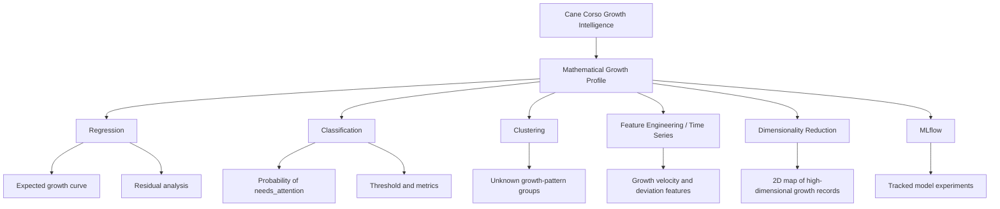

# Cane Corso Growth Intelligence

**Machine Learning for Predictive Growth Monitoring and Early Growth Pattern Detection**

Cane Corso Growth Intelligence is a machine learning project that turns dog growth records into mathematical, visual, and owner-friendly insights.

The project is not only about predicting a dog's weight. The stronger idea is to build a **mathematical growth profile**: a way to represent each growth record as data, compare it with expected development, detect unusual patterns, group similar development profiles, and explain the result clearly.

The practical story is simple: an owner can record information such as age, weight, sex and body measurements over time. The system can then estimate expected growth, classify whether the record looks normal or needs attention, compare the dog with similar growth patterns, and show the result through understandable signals and charts.

This is an educational machine learning project. It does **not** provide veterinary diagnosis, medical advice, pedigree proof, or breed certification. Model outputs are used for analysis, learning, comparison, and responsible monitoring only.

---

## Why This Project Is Interesting

Large-breed puppies can grow quickly and unevenly. A single measurement, such as today's weight, is not enough to understand the full development story.

This project treats growth as a mathematical process:

```text
simple owner record -> feature vector -> model prediction -> error / probability / cluster -> interpretation
```

Instead of asking only:

```text
How many kilograms will the dog weigh?
```

it asks stronger machine-learning questions:

```text
Is this growth record close to the expected pattern?
How large is the deviation from the model prediction?
What is the probability that the record needs attention?
Which growth-pattern group does this dog resemble?
How does the trajectory change over time?
How do different models compare mathematically?
```

This makes the project useful beyond a course assignment: it can become the foundation for a practical growth-monitoring assistant.

---

## Mathematical Framing

Each dog growth record is represented as a feature vector:

```text
x = [age_months, weight_kg, height_cm, sex_encoded, body_ratio, growth_velocity, deviation_from_expected]
```

Different course topics use the same data representation in different ways:

| Course area | Mathematical task | Project meaning |
|---|---|---|
| Regression | learn `weight = f(x)` | estimate expected growth / future bodyweight |
| Classification | learn `P(needs_attention | x)` | create a probability-based growth signal |
| Clustering | discover unknown groups | find natural growth-pattern profiles |
| Feature Engineering | transform raw measurements | create growth velocity, ratios, deviations |
| Time Series | analyze ordered records | monitor development as a trajectory |
| Dimensionality Reduction | project high-dimensional data | visualize structure and separation |
| MLflow | track experiments | compare models, metrics, parameters and runs |

The project is designed to show the full flow:

```text
real-world problem -> mathematical formulation -> data preparation -> model training -> evaluation -> interpretation -> limitations
```

---

## How the Model Learns

The models learn from historical growth records.

For regression, the model predicts a numerical value and compares the prediction with the known real value:

```text
residual = real_weight - predicted_weight
```

Training means finding parameters that reduce prediction error, for example by minimizing squared error:

```text
minimize sum((y_real - y_pred)^2)
```

For classification, the model learns a probability:

```text
P(needs_attention | x)
```

A threshold converts that probability into a class:

```text
if probability >= threshold -> needs_attention
else -> normal_growth
```

The project evaluates models on unseen test data using metrics such as MAE, RMSE, R2, precision, recall, F1-score, ROC and AUC.

A dedicated explanation is available in:

```text
docs/model_learning_explanation.md
```

---

## Data Foundation

The project uses two data layers.

### 1. Prototype Cane Corso Sample

```text
data/prototype/cane_corso_growth_sample.csv
```

A small educational sample created for the first regression experiments.

### 2. Real Public Dog Growth Dataset

The stronger project foundation is a public dog growth dataset from the University of Liverpool DataCat:

```text
Growth standard charts for monitoring bodyweight in dogs of different sizes - SUPPORTING DATA
```

The related scientific publication is:

```text
Growth standard charts for monitoring bodyweight in dogs of different sizes, PLOS ONE, 2017
```

The project does **not** claim to have private Cane Corso veterinary records. The Cane Corso domain is the practical product case, while the real public dataset provides the broader growth-data foundation for machine learning experiments.

Processed samples used in the project:

```text
data/processed/dog_growth_public_sample.csv
data/processed/dog_growth_classification_sample.csv
```

Raw external files should stay local in `data/raw/` and should not be committed to GitHub.

---

## Current Project Status

Completed stages:

1. **Linear Regression, Regularization and Testing**
2. **Real Data Foundation**
3. **Classification**
4. **Classification Pipeline Exercise Extension**

Next planned course topic:

```text
Unsupervised Learning, Clustering
```

---

## Project Structure

```text
cane-corso-growth-intelligence/
├── data/
│   ├── prototype/
│   │   └── cane_corso_growth_sample.csv
│   ├── raw/
│   │   └── source_notes.md
│   └── processed/
│       ├── dog_growth_public_sample.csv
│       └── dog_growth_classification_sample.csv
├── docs/
│   ├── product_idea_and_mathematical_framing.md
│   ├── model_learning_explanation.md
│   ├── real_data_source_notes.md
│   ├── real_data_download_instructions.md
│   ├── data_preparation_plan.md
│   ├── math_foundation.md
│   └── geometric_interpretation.md
├── notebooks/
│   ├── 00_project_concept_and_mathematical_framing.ipynb
│   ├── 01_linear_regression_growth_prediction.ipynb
│   ├── 02_real_data_preparation.ipynb
│   ├── 03_classification_growth_status.ipynb
│   └── 03_1_classification_pipeline_exercise.ipynb
├── reports/
│   └── figures/
├── src/
│   ├── create_public_sample.py
│   └── create_classification_sample.py
├── COURSE_TOPIC_MAPPING.md
├── DATA_SOURCES.md
├── HOW_TO_RUN.md
├── PROJECT_BRIEF.md
├── README.md
└── requirements.txt
```

---

## Notebooks

### 0. Project Concept and Mathematical Framing

```text
notebooks/00_project_concept_and_mathematical_framing.ipynb
```

Explains the product idea, mathematical representation, learning process, data layers, and responsible interpretation boundaries.

### 1. Regression Topic

```text
notebooks/01_linear_regression_growth_prediction.ipynb
```

Covers simple linear regression, polynomial regression, multi-dimensional regression, Ridge, Lasso, RANSAC, and regression metrics.

### 2. Real Data Preparation

```text
notebooks/02_real_data_preparation.ipynb
```

Documents the transition from prototype data to real processed public dog growth data.

### 3. Classification Topic

```text
notebooks/03_classification_growth_status.ipynb
```

Covers binary classification, Logistic Regression, Decision Tree, Random Forest, AdaBoost, SVM, confusion matrix, precision, recall, F1-score, ROC and AUC.

### 3.1. Classification Pipeline Exercise

```text
notebooks/03_1_classification_pipeline_exercise.ipynb
```

Adds dummy baselines, preprocessing pipelines, cross-validation, learning curves, feature engineering, permutation importance, error analysis, and ablation study.

---

## Course Topic Flow



---

## Documents

| File | Purpose |
|---|---|
| `PROJECT_BRIEF.md` | Main project story and scope |
| `docs/product_idea_and_mathematical_framing.md` | Strong explanation of the useful and interesting idea |
| `docs/model_learning_explanation.md` | How the models learn, step by step |
| `docs/math_foundation.md` | Mathematical formulas and model intuition |
| `docs/geometric_interpretation.md` | Coordinate-space view of models and feature space |
| `DATA_SOURCES.md` | Prototype, raw and processed data documentation |
| `COURSE_TOPIC_MAPPING.md` | Mapping between course lectures and project files |

---

## Responsible Interpretation

The project can support analysis and owner-friendly monitoring, but it must be interpreted carefully.

Correct interpretation:

```text
The model gives an educational growth-monitoring signal based on available data.
```

Incorrect interpretation:

```text
The model diagnoses health problems or proves whether a dog is a Cane Corso.
```

The safest final product direction is:

```text
record data -> show trend -> estimate expected growth -> show signal -> explain limitations
```
